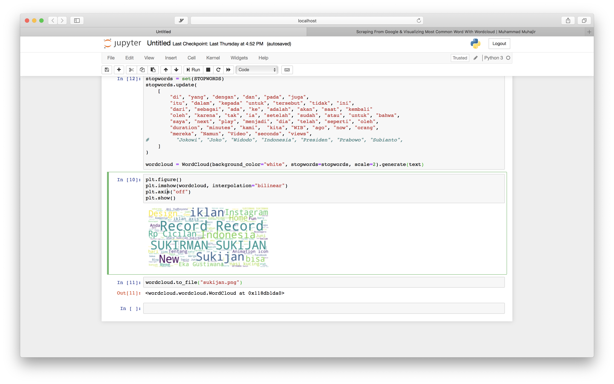

Have you tried searching your name on Google? Or somebody else's name? What's the most common word associated with your name? In this tutorial we'll find out :)

Requirements:

- Python
- Internet Connection :)

We have 2 sections in this Tutorial. `Scraping` and `Visualizing`

# Scraping

## Installing Scrapy:

```
pip install scrapy
```

## First try

Let's create our project.

```
scrapy startproject google
cd google
```

Let's trying searching your name on Google.
I am going to assume your name is `Sukijan`.

## Get all text

Let's try to get all the text from a url. I'll try with this url `https://www.aljazeera.com/news/2019/06/israeli-forces-settlers-enter-al-aqsa-mosque-compound-190602065712978.html` (One of the first news I got this morning)

Create, a file `google/google/spiders/test.py`

```python
import scrapy


class TestSpider(scrapy.Spider):
    name = 'test'

    # Tell scrapy, we want to start crawing with these pages
    start_urls = [
        'https://www.aljazeera.com/news/2019/06/israeli-forces-settlers-enter-al-aqsa-mosque-compound-190602065712978.html']

    # What we're going to do after the page is resolved
    def parse(self, response):
        # We yield a dict of this
        yield {
            # response.css is css style selector.
            # ::text means we want to to get the text. If we don't put ::text
            # We'll get <title>Israeli forces and settlers ...</title>
            # When we add text we got 'Israeli forces and settlers ...'
            'title': response.css('title::text').get(),
            # Same thing with `p`, We're selecting the text of element p
            # But notice that we use `getall` instead of `get`
            # `get` will select only one element.
            # While `getall`  Will select all element, and return list
            'text': response.css('p::text').getall()
        }
```

Now try to run `scrapy crawl test`.You'll see in the the result in the command line.

Let's try to write the result to a file with `scrapy crawl test -o result.json`

Now you can see the result in JSON format in `result.json`

## Get links from Google

Let's try to crawl many URLS from google

First of all. go to `settings.py`
and make sure

```
...
ROBOTSTXT_OBEY = False
...
```

```python
import scrapy
import re


def is_google(a):
    url = a.attrib['href']
    return bool(re.search("/search", url))


class TestSpider(scrapy.Spider):
    name = "test"

    # How to get the start url
    # search `sukijan` on Google. And then go to second page, and then click first page result. You'll see that the url now includes `start` parameter. We'll use that for pagination
    # Also pay attention to parameter `q=sukijan`. That's our keyword
    # We use `% start for start in range(0, 100, 10)`. To generate urls that we want to crawl
    # So it will generate a list of urls like so
    # [q=sukijan start =0, q=sukijan start=10, q=sukijan start=20, q=sukijan, start=30... until 100]

    start_urls = [
        'https://www.google.com/search?q=sukijan&safe=strict&ei=sLTvXL_KH4zfz7sPpZOBuA4&start=%s&sa=N&ved=0ahUKEwi_4un2icPiAhWM73MBHaVJAOc4ChDx0wMIjQE&cshid=1559213273144254&biw=1680&bih=916' % start for start in range(0, 100, 10)
    ]

    def parse(self, response):
        # What is `jfp3ef a`
        # If you do `scrapy shell https://www.google.com/search?q=Sukijan&oq=sukijan&aqs=chrome.0.69i59j0l5.1739j0j7&sourceid=chrome&ie=UTF-8#ip=1`
        # And then do `view(response)`. It will open up a browser
        # From there do inspect element, locate a link, And you'll find that most of the links fall under `.jfp3ef` class
        for href in response.css('.jfp3ef a'):
            # We want to open url these links. But we don't want to open Google's url
            # For example url `More images for Sukijan`, etc.
            if not is_google(href):
                # This basically means 'Hey scrapy` follow this url.
                # When you find it run parse_text function on it.
                yield response.follow(href, self.parse_text)

    def parse_text(self, response):

        # get_text takes the response
        # And then it will takes all text whether it's in <p> tag, <h1> tag, <h2> tag etc
        # But it will leave everything inside <script> and <style>
        # It will also remove `\r`, `\n`, `\t`
        # Plus it combines all the text into a string, instead of a list

        def get_text(response):
            with_duplicated_space = ' '.join(response.xpath(
                './/text()[not(ancestor::script|ancestor::style|ancestor::noscript)]').extract()).strip().replace("\r", "").replace("\n", "").replace("\t", "")
            without_duplicated_space = re.sub(
                ' +', ' ', with_duplicated_space).strip()
            return without_duplicated_space

        yield {
            'title': response.css('title::text').get(),
            'text': get_text(response)
        }

```

Okay okay, that's a lot of things going on right. Please let me know if my explanation is confusing. I am always open to feedback. Tweet me @muhajirdev on twitter

Let step, delete your `result.json` And re run again `scrapy crawl test -o result.json`. And wait until the crawling process is finished

# Visualizing with Wordcloud

Okay now open jupyter notebook. You can install with

Python 3:

```
python3 -m pip install --upgrade pip
python3 -m pip install jupyter
```

Python 2:

```
python -m pip install --upgrade pip
python -m pip install jupyter
```

Depending on your python version

You can read more installation instruction here https://jupyter.org/install.html

Create a file `File > New Notebook > Python 3`

```
jupyter notebook
```

```python
import json

text = ''
with open("result.json", "r") as read_file:
    data = json.load(read_file)
    for i in data:
        text = text + i['text']


from wordcloud import WordCloud, STOPWORDS, ImageColorGenerator
import matplotlib.pyplot as plt

wordcloud = WordCloud(background_color="white").generate(text)


stopwords = set(STOPWORDS)
# Most of my content is in Bahasa Indonesia. So I am adding more stopwords in Bahasa Indonesia
stopwords.update(
    [
        "di", "yang", "dengan", "dan", "pada", "juga",
        "itu", "dalam", "kepada" "untuk", "tersebut", "tidak", "ini",
        "dari", "sebagai", "ada", "ke", "adalah", "akan", "saat", "kembali"
        "oleh", "karena", "tak", "ia", "setelah", "sudah", "atau", "untuk", "bahwa",
        "saya", "next", "play", "menjadi", "dia", "telah", "seperti", "oleh",
        "duration", "minutes", "kami",  "kita", "WIB", "ago", "now", "orang",
        "mereka", "Namun", "Video", "seconds", "views",
    ]
)

wordcloud = WordCloud(background_color="white", stopwords=stopwords, scale=2).generate(text)
```

Okay, now let's try to visualize it

```python
plt.figure()
plt.imshow(wordcloud, interpolation="bilinear")
plt.axis("off")
plt.show()
```



You can see there that `Sukijan` is highy tied with `Indonesia`, `Sukirman`, also there's `Eka Gustiwana`.

But how do we save it to a file? Simply

```python
wordcloud.to_file("sukijan.png")
```

Now there should a file named `sukijan.png` containing the wordcloud

I'd love to hear some feedback from you :). Tweet me @muhajirdev on twitter
