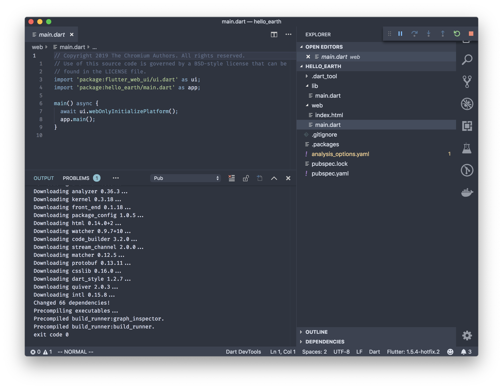
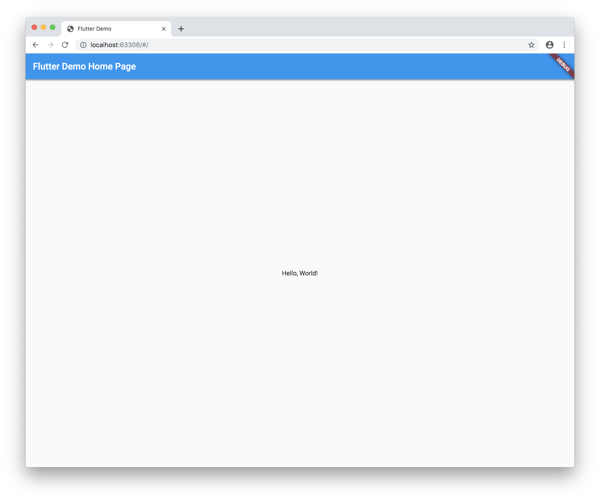

Google just released for [flutter for web]. This is awesome. With flutter, you will be able to use single codebase to develop iOS App, Android App, Desktop App, Web and Embedded 🌟


We'll give it a shot

# Getting Started

### Install Flutter / Upgrade Flutter

Follow the installation path here on [Flutter Official Docs](https://flutter.dev/docs/get-started/install)

Or just upgrade it if have ever installed it

```bash
flutter upgrade
```

Reference:

- [Install Flutter](https://flutter.dev/docs/get-started/install)

### Create new project

You can either clone `flutter/flutter_web`. like so

```bash
# Clone
git clone https://github.com/flutter/flutter_web

# cd into example dir
cd flutter_web/examples/hello_world

# Activate web build tool
flutter packages pub global activate webdev
```

Or just use Visual Studio Code. Install `Dart Code` & `Flutter` Plugins.

And then `cmd + shift + p` (on mac) or `ctrl + shift + p` (on windows/linux).
And type `>Flutter: New Web Project`


After it's done. Go to `main.dart` and press `F5`(Debug shortcut) on your laptop. Or Press ▶️ on Macbook Pro Touchbar

That's it. Look at this beauty



I'll next update about flutter web. I'll let you guys know via my twitter [@muhajirdev](https://twitter.com/muhajirdev)
