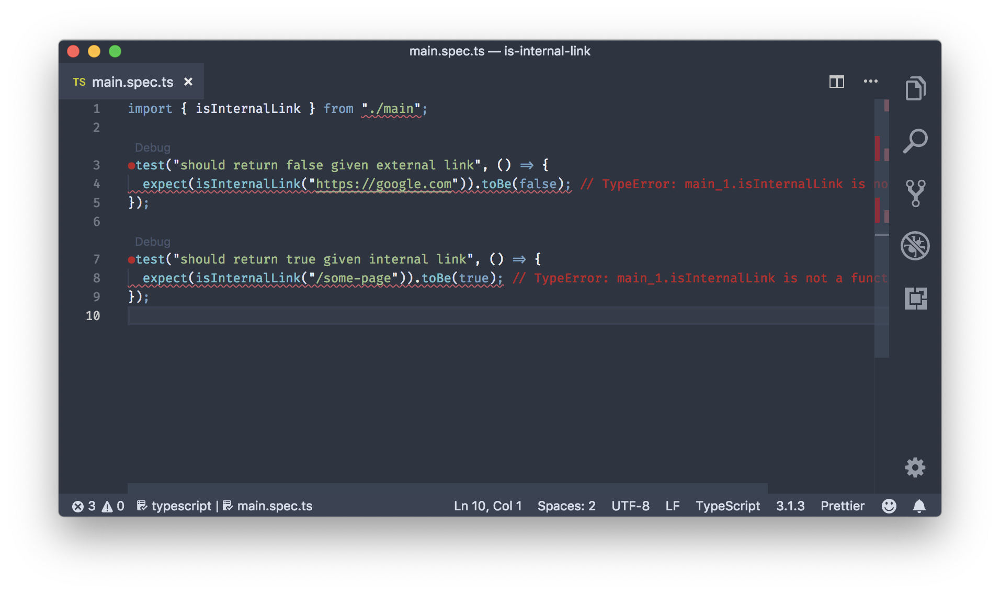

In this article we'll try to cover a simple unit testing in Typescript + jest.

We're going to create a simple utility that detect whether an url is internal link or external link.
For example `https://www.google.com` is an external link, while `/page1` is an internal link. We're going to name the project `is-internal-link`, but you can name it anything.

## Prerequisites

- NodeJS
- VSCode + Jest plugin (Optional)

Create new directory

```bash
mkdir is-internal-link
```

Init npm

```bash
npm init
```

Install dependencies

```bash
npm install --save-dev @types/jest @types/node jest ts-jest typescript
```

Create `jest.config.js`

```javascript
module.exports = {
  roots: ['<rootDir>/src'],
  transform: {
    '^.+\\.tsx?$': 'ts-jest',
  },
  testRegex: '(/__tests__/.*|(\\.|/)(test|spec))\\.tsx?$',
  moduleFileExtensions: ['ts', 'tsx', 'js', 'jsx', 'json', 'node'],
}
```

Create `tsconfig.json`

```javascript
{
  "compilerOptions": {
    "target": "es5",
    "module": "commonjs",
    "lib": ["es2015"],
    "strict": true,
    "declaration": true,
    "outDir": "dist",
    "sourceMap": true,
  },
  "include": ["src/**/*"],
  "exclude": ["node_modules", "**/*.spec.ts"]
}
```

All right we're ready to write the code. Create file `src/main.ts` and `src/main.spec.ts`
Your files tree should now looks like this

```
.
├── node_modules
├── package-lock.json
├── package.json
├── src
│   ├── main.spec.ts
│   └── main.ts
└── tsconfig.json
```

Open it in your favorite editor. (VSCode / Atom / Sublime / etc).
I personally use VSCode

```javascript
import { isInternalLink } from './main'

test('should return false given external link', () => {
  expect(isInternalLink('https://google.com')).toBe(false)
})

test('should return true given internal link', () => {
  expect(isInternalLink('/some-page')).toBe(true)
})
```

Now there's to way to test this.

### Way 1

Open your `package.json`. And replace it your `scripts` with

```json
 "scripts": {
    "test": "jest"
  },
```

Run `npm run jest`.
Now you should see the error because we haven't implemented the code yet right?

### Way 2

With your editor's plugin. I prefer this way. I'll only show it on VSCode. Your favorite editor might have it too.

Install [vscode-jest](https://github.com/jest-community/vscode-jest)


This GIF, should be self a great explanation how vscode-jest works

Let's continue.
 

Your VSCode might now looks like this.

Let's implement our `main.ts`

```javascript
export const isInternalLink = (link: string) => /^\/(?!\/)/.test(link)
```

Switch back to your `main.spec.ts`. You should see now the error is gone, and it turns green.

PRO TIPS: Use [VSCode split editor](https://code.visualstudio.com/docs/getstarted/userinterface#_side-by-side-editing) to see the code (`main.ts`) and spec (`main.spec.ts`) at the same time.

TL;DR

Open `main.ts` on first side `cmd+1` `cmd+p` `main.ts`

Open `main.spec.ts` on second side `cmd+2` `cmd+p1` `main.spec.ts`

Congratulations!

You just did your Unit Testing with Typescript and Jest
